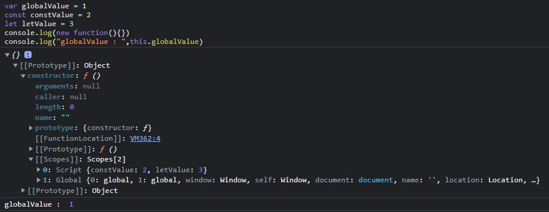

# 스코프(scope)

자바스크립트를 공부하다보면 **스코프(scope)** 라는 단어를 많이 볼 수 있습니다.

그렇다면 **스코프** 란 무엇일까요?

프로그래밍에서 스코프는 현재 실행중인 **컨텍스트** 를 의미합니다.

변수나 다른 표현식이 해당 스코프 안에 있지 않다면 사용할 수 없습니다. 

스코프는 **계층적인 구조**를 가지고 있기에 **하위 스코프**에서 **상위 스코프**에 **접근이 가능**하지만,

**상위 스코프**에서 **하위 스코프**로의 **접근이 불가능**합니다.

예시로 보겠습니다.

```javascript
let z = "함수 밖에 변수 선언";
const exFunc = () => {
    let x = "함수 안에 변수 선언";
    const y = "함수 안에 상수 선언"
    // x는 오직 exFunc 함수 내부에서만 사용 가능.
    console.log("Inside function");
    console.log(x); // 현재 스코프의 x값 출력
    console.log(y); // 현재 스코프의 y값 출력
    console.log(z); // 상위 스코프의 z값 출력
}
console.log(x); // 에러 발생
console.log(y); // 에러 발생
console.log(z); // "함수 밖에 변수 선언" 출력
```
<br/>

## 전역 스코프
> 코드 어디에서든지 참조할 수 있습니다.

## 지역(함수, 블록) 스코프
> 함수와 블록이 만든 스코프로 현재 함수와 블록 자신과 하위 **함수와 블록**에서만 참조할 수 있다.
> 
<br/>



위 코드를 보게되면 scope의 속성으로  const와 let 선언만 들어가 있는 것을 볼 수 있습니다.

함수를 선언 할 때 상위 스코프의 상수와 변수만 가져왔습니다.

반대로 var을 사용하여 선언한 globalValue 만 Global에 들어있는 것을 볼 수 있습니다.

<br/>

### 표로 정리해 보겠습니다

|   |전역 스코프 |함수 스코프 |블록 스코프| 재정의 여부|
|:---:|:---:|:---:|:---:|:---:|
|var | O | O | X | O |
|let | X | O | O | O |
|const | X | O | O | X |

<br/>

이번에는 다른 예시로 살펴볼까요?
```javascript  
// 전역 스코프
var data = "global scope";
function a(){ // 함수 스코프
    // 1번 위치
    var data = "function scope";
    b();
}
function b(){
    console.log(data)
}
{
    // 2번 위치
    var data = "block scope"
}
a()
b()
console.log(data)

// 1.   
// local scope
// global scope
// global scope

// 2.
// global scope
// global scope
// global scope
```
위 코드의 결과값은 어떻게 될까요?

답은 2 입니다.

1번 위치 2번위치의 data는 각각 함수 스코프, 블록 스코프 안에서 선언한 것이기에 글로벌 스코프의 data를 재정의 할 수 없습니다.


